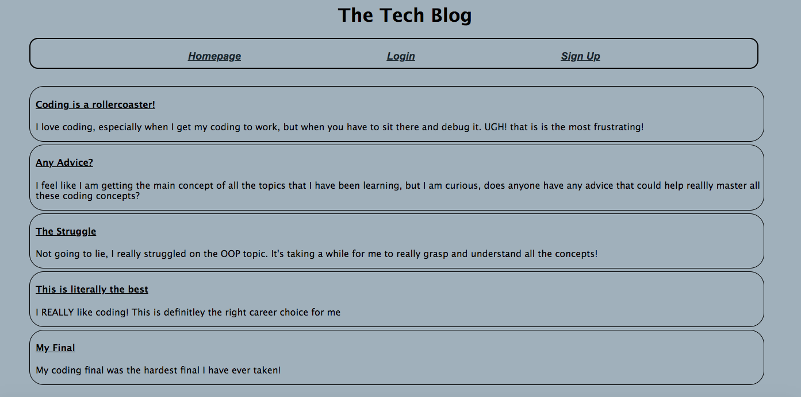

# challenge-14-model-view-controller-tech-blog

## Description
  
  In this weeks challenge I was tasked to complete a application with the front-end code and the back-end code. With the blog-site the home page is presented when you first arrive at the page. You are then presented with links at the top to login, sign up, or homepage. On the homepage, there is listed existing posts from all the users. If you click on one of the posts you are prompted to login with your credentials to view the details of the post. If the user does not have an account they must click the sign up page to create a account. Once the user is logged in the user is prompted to the their dashboard. On their dashboard they are able to see their posts that they have created before, and a input box to create a new post if they desire. Once they create a post it is added to their post list on their dashboard and on to the homepage. The user is able to click on any of their post that they have created and it will show the details of it. Once the user navigates to the homepage. They are presented with a list of all the existing posts of all users. They are able to click on any post and the details of that post will be revealed. When the post is shown they are able to see the post description and any comments associated with it. They are also able to add a comment to the post. When they create the comment it will get posted within the post's details. Once the user is done with their session. they are able to logout by simply clicking the logout link in the nav bar. They will be logged out and taken back to the homepage. 
 

## Installation

For this application to work bcrypt, connect-session-sequelize, dotenv, express.js, express-handlebars.js, express-session, MySQL, and Sequelize needs to be installed. 

## Usage

This application is great for anyone that is trying to connect to other people in the tech world. The user is able to share their feelings, experience, projects, etc. The user is also able to respond to others and connect.

https://mysterious-reef-05258.herokuapp.com/

## Credits

N/A

## License

Please refer to the LICENSE in the repo